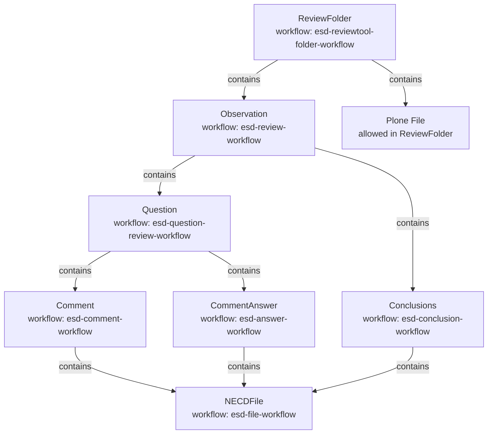
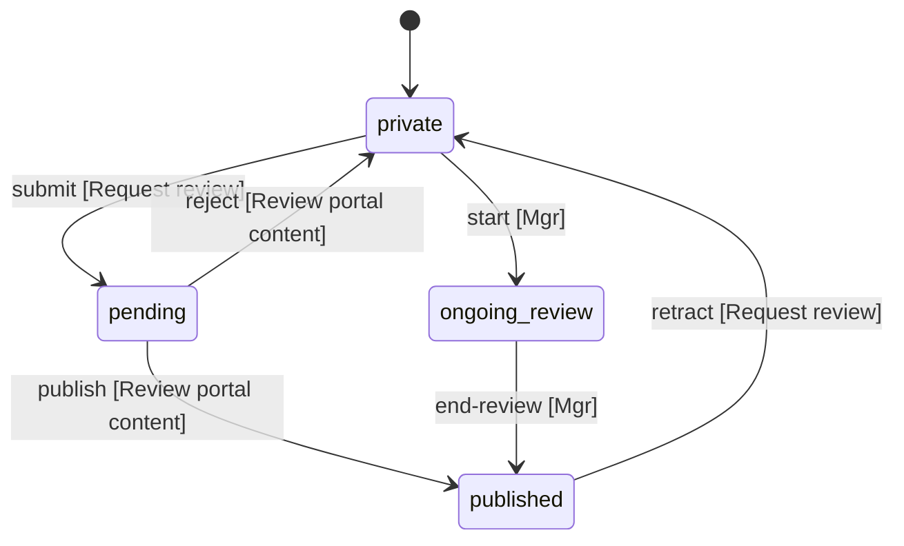
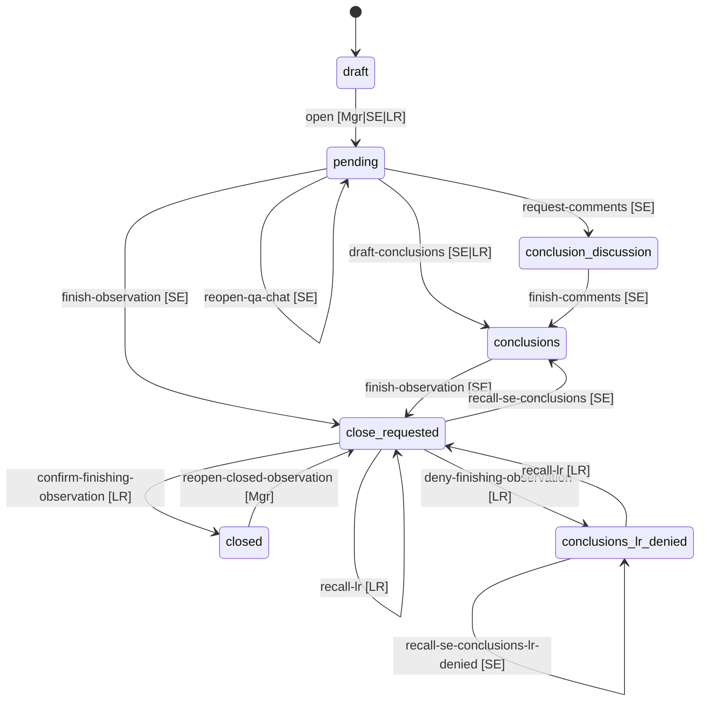
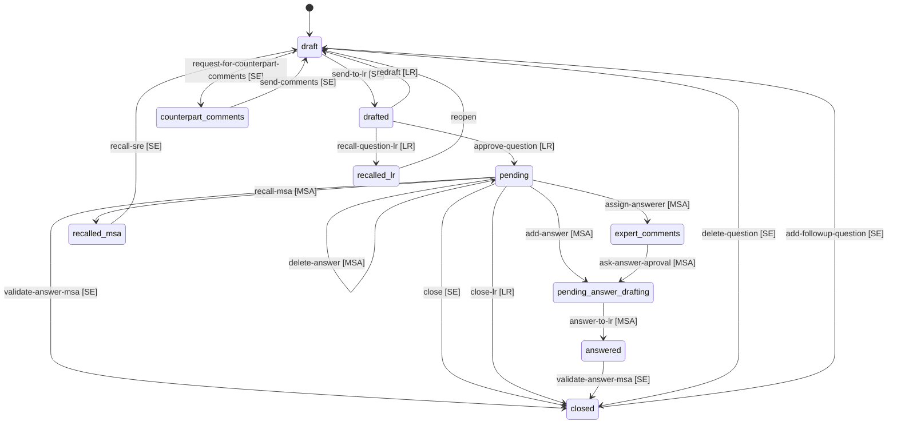
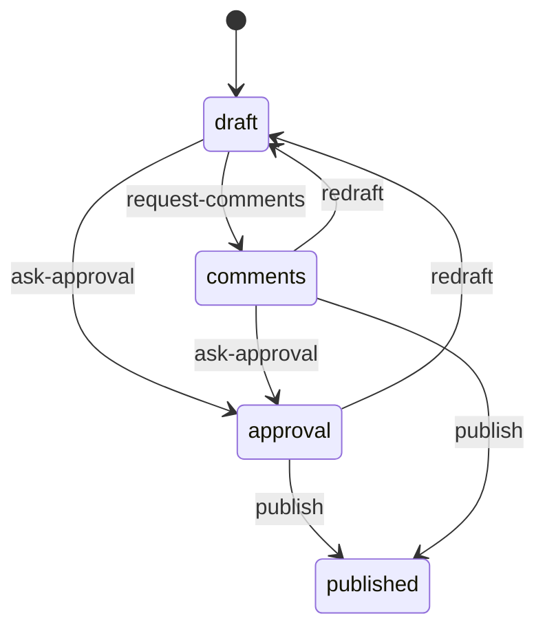
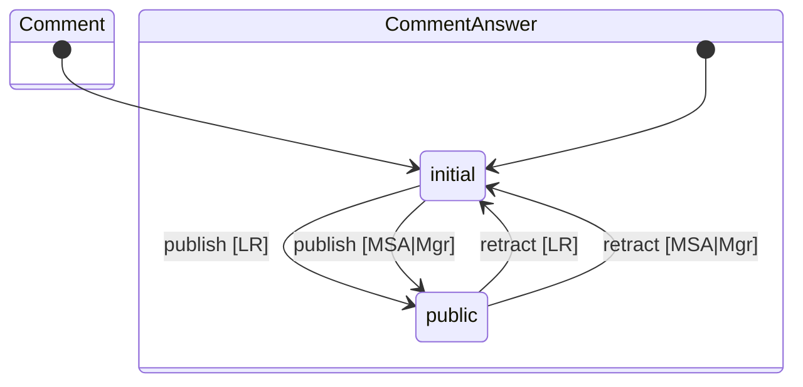
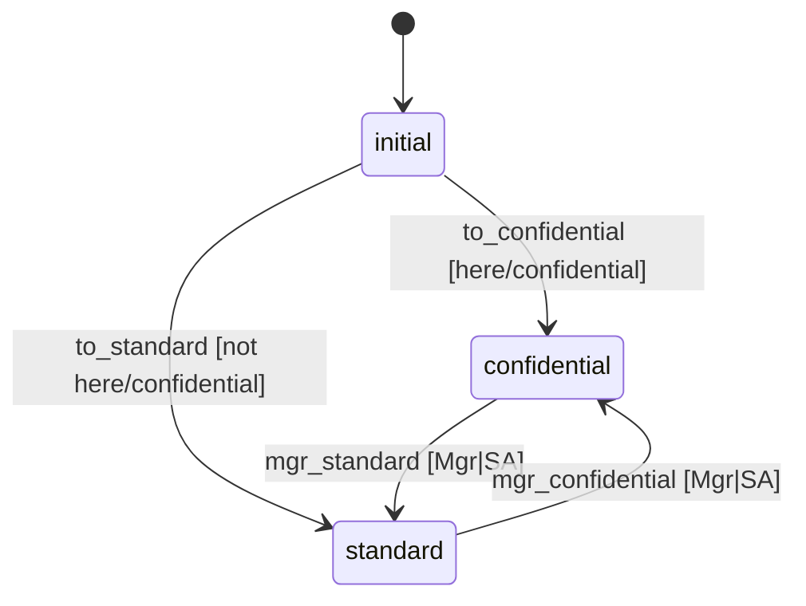

# Content Model And Workflows

Generated from:

- `profiles/default/types/*.xml`
- `profiles/default/workflows.xml`
- `profiles/default/workflows/*/definition.xml`
- `profiles/default/rolemap.xml`
- `roles/localroles.py`

## Role Legend

- `CP`: `CounterPart`
- `LR`: `LeadReviewer`
- `MSA`: `MSAuthority`
- `MSE`: `MSExpert`
- `SE`: `SectorExpert`
- `Mgr`: `Manager`
- `SA`: `Site Administrator`
- `Own`: `Owner`
- `Anon`: `Anonymous`
- `ER`: `ExpertReviewer`

Notes:

- `Observation`, `Question`, `Comment`, `CommentAnswer`, and `Conclusions` derive local roles from the parent `Observation` via `roles/localroles.py`.
- Those local roles are computed from the current user, the observation country, and the sector/NFR mapping.
- `ReviewFolder` access is mainly driven by its own workflow state and globally assigned roles.
- `ER` appears in `esd-file-workflow`, but `sharing.xml` removes it from the sharing UI, so it looks stale.

## Content Type Graph

## ReviewFolder Workflow

| State | Visible to | Can modify | Add Observation |
|---|---|---|---|
| `private` | `Mgr`, `Own` | `Mgr`, `Own` | `Mgr` |
| `pending` | `Mgr`, `Own` | `Mgr` | `Mgr` |
| `ongoing-review` | `Anon`, `CP`, `LR`, `MSA`, `MSE`, `Mgr`, `Own`, `SE` | `Own` | `Mgr`, `LR`, `SE` |
| `published` | `Anon` | `Mgr`, `Own` | `Mgr` |

## Observation Workflow

Actions with no state change:

- `recall-se` in `close-requested` by `SE`
- `edit-highlights` by `SE` or `LR`

| State | Visible to | Can modify | Key extra capabilities |
|---|---|---|---|
| `draft` | `LR`, `Mgr`, `SE` | `Mgr`, `SE` | `Add Question`: `Mgr`, `SE`; `Add Conclusions`: `SE`, `LR` |
| `pending` | `CP`, `LR`, `MSA`, `MSE`, `Mgr`, `SE` | `LR`, `Mgr`, `SE` | `Add Question`: `SE`; `Add Conclusions`: `SE`, `LR`; `View Comment Discussion`: `CP`, `LR`, `SE`; `View Answer Discussion`: `MSA`, `MSE` |
| `conclusions` | `LR`, `MSA`, `MSE`, `Mgr`, `SE` | `SE`, `LR` | `Add Conclusions`: `SE`, `LR` |
| `conclusion-discussion` | `CP`, `LR`, `MSA`, `MSE`, `Mgr`, `SE` | `Mgr` | `View Conclusion Discussion`: `CP`, `LR`, `Mgr`, `SE` |
| `close-requested` | `LR`, `MSA`, `Mgr`, `SE` | `LR`, `Mgr` | `View Conclusion Discussion`: `LR`, `Mgr`, `SE` |
| `conclusions-lr-denied` | `LR`, `MSA`, `MSE`, `Mgr`, `SE` | `SE`, `LR` | `Add Conclusions`: `SE`, `LR` |
| `closed` | `LR`, `MSA`, `MSE`, `Mgr`, `SE` | `Mgr` | `Add Question`: `Mgr` |

## Question Workflow

Actions with no state change:

- `finish-observation-lr` by `LR`
- `finish-observation-re` by `SE`
- `draft-conclusions` by `SE`
- `go-to-conclusions` by `SE`
- `eselect-msexperts` by `MSA`
- `reselect-counterparts` by `SE`

| State | Visible to | Can modify | Key extra capabilities |
|---|---|---|---|
| `draft` | `CP`, `LR`, `Mgr`, `SE` | `Mgr`, `SE` | `Add Comment`: `Mgr`, `SE`; `Edit Comment`: `Mgr`, `SE`; `Add CommentAnswer`: `Mgr`; `Edit CommentAnswer`: `Mgr`; `Add NECDFile`: `Mgr`, `SE` |
| `drafted` | `CP`, `LR`, `Mgr`, `SE` | `LR`, `Mgr` | `Edit Comment`: `LR`; `Add NECDFile`: `LR`; `View Comment Discussion`: `CP`, `LR`, `SE` |
| `pending` | `CP`, `LR`, `MSA`, `MSE`, `Mgr`, `SE` | `Mgr` | `Add Comment`: `Mgr`; `Add CommentAnswer`: `MSA`, `Mgr`; `Edit CommentAnswer`: `MSA`, `Mgr`; `Add NECDFile`: `MSA` |
| `pending-answer-drafting` | `CP`, `LR`, `MSA`, `MSE`, `Mgr`, `SE` | `Mgr` | `Edit CommentAnswer`: `MSA`; `Add NECDFile`: `MSA`, `Mgr`; `View Answer Discussion`: `MSA`, `MSE` |
| `answered` | `CP`, `LR`, `MSA`, `MSE`, `Mgr`, `SE` | `Mgr` | `View Answer Discussion`: `MSA`, `MSE`; `View Comment Discussion`: `LR`, `SE` |
| `expert-comments` | `CP`, `LR`, `MSA`, `MSE`, `Mgr`, `SE` | `Mgr` | `Reply to item`: `MSA`, `MSE`; `View Answer Discussion`: `MSA`, `MSE` |
| `counterpart-comments` | `CP`, `LR`, `Mgr`, `SE` | `Mgr` | `Reply to item`: `CP`, `LR`, `SE`; `View Comment Discussion`: `CP`, `LR`, `SE` |
| `recalled-lr` | `CP`, `LR`, `Mgr`, `SE` | `Mgr` | `Edit Comment`: `LR`; `Add NECDFile`: `LR`; `View Comment Discussion`: `LR`, `SE` |
| `recalled-msa` | `CP`, `LR`, `MSA`, `MSE`, `Mgr`, `SE` | `Mgr` | `Edit CommentAnswer`: `MSA`, `MSE`, `Mgr`; `Add NECDFile`: `MSA`, `MSE`, `Mgr`; `View Answer Discussion`: `MSA`, `MSE` |
| `closed` | not explicitly mapped except `Add Comment` | not explicitly mapped | `Add Comment`: `Mgr`, `SE` |

## Conclusions Workflow

Notes:

- The transitions in `esd-conclusion-workflow` have no explicit `guard-role` or `guard-permission` in the workflow XML.
- Effective access is therefore mostly controlled by the state-level permission maps.

| State | Visible to | Can modify | Key extra capabilities |
|---|---|---|---|
| `draft` | `LR`, `Mgr`, `SE` | `Mgr`, `SE` | `Add NECDFile`: `Mgr`, `Own`, `SE`; `View Conclusion Discussion`: `LR`, `Mgr`, `SE` |
| `approval` | `LR`, `Mgr`, `SE` | `LR`, `Mgr` | `Add NECDFile`: `LR`, `Mgr`; `View Conclusion Discussion`: `LR`, `Mgr`, `SE` |
| `comments` | `CP`, `LR`, `Mgr`, `SE` | `Mgr` | `Reply to item`: `CP`, `LR`, `Mgr`, `SE`; `View Conclusion Discussion`: `CP`, `LR`, `Mgr`, `SE` |
| `published` | `LR`, `MSA`, `MSE`, `Mgr`, `SE` | `Mgr` | `View Conclusion Discussion`: `LR`, `Mgr`, `SE` |

## Comment And Answer Workflows

| Workflow | State | Visible to | Can modify | Key extra capabilities |
|---|---|---|---|---|
| `Comment` | `initial` | `CP`, `LR`, `Mgr`, `SE` | none explicit | delete objects: `Mgr` |
| `Comment` | `public` | `CP`, `LR`, `MSA`, `MSE`, `Mgr`, `SE` | `Mgr` | `Edit Comment`: `Mgr`; `Add NECDFile`: `Mgr` |
| `CommentAnswer` | `initial` | `MSA`, `MSE`, `Mgr` | `MSA`, `Mgr` | delete: `MSA`, `Mgr`; `Add NECDFile`: `MSA`, `Mgr` |
| `CommentAnswer` | `public` | `CP`, `LR`, `MSA`, `MSE`, `Mgr`, `SE` | `Mgr` | `Edit CommentAnswer`: `Mgr`; `Add NECDFile`: `Mgr` |

## NECDFile Workflow

| State | Visible to | Can modify |
|---|---|---|
| `confidential` | `LR`, `MSA`, `MSE`, `Mgr`, `SE`, `SA` | `Mgr`, `SA` |
| `standard` | `ER`, `LR`, `MSA`, `MSE`, `Mgr`, `SE`, `SA` | `Mgr`, `SA` |

## High-Level Access Pattern

- `ReviewFolder` opens the review to more roles only in `ongoing-review`.
- `Observation` starts as `SE`-driven work, opens to `MSA` and `MSE` in `pending`, and narrows again near closure.
- `Question` is the most role-sensitive workflow:
  - `SE` authors and routes questions.
  - `LR` approves/redrafts.
  - `MSA` drafts and submits answers.
  - `MSE` mainly participates through answer discussion visibility and reply rights in `expert-comments`.
  - `CP` participates in `counterpart-comments`.
- `Comment` and `CommentAnswer` visibility broadens after publication.
- `Conclusions` remain mostly `SE` and `LR` driven until `published`.
